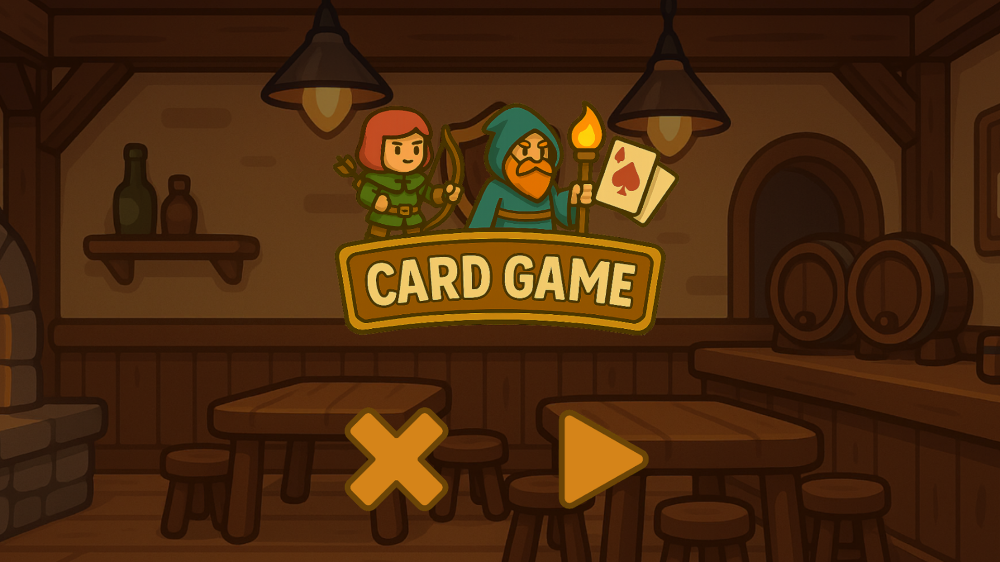
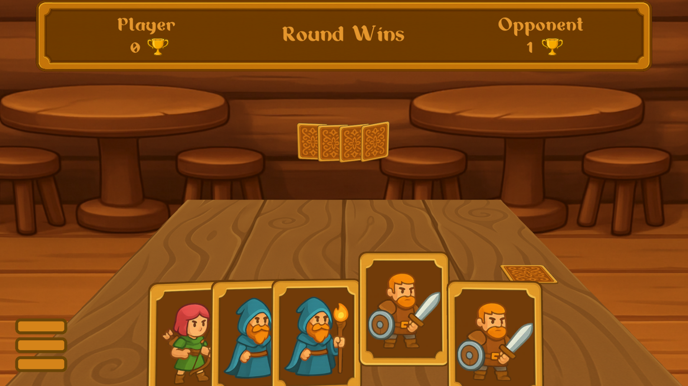
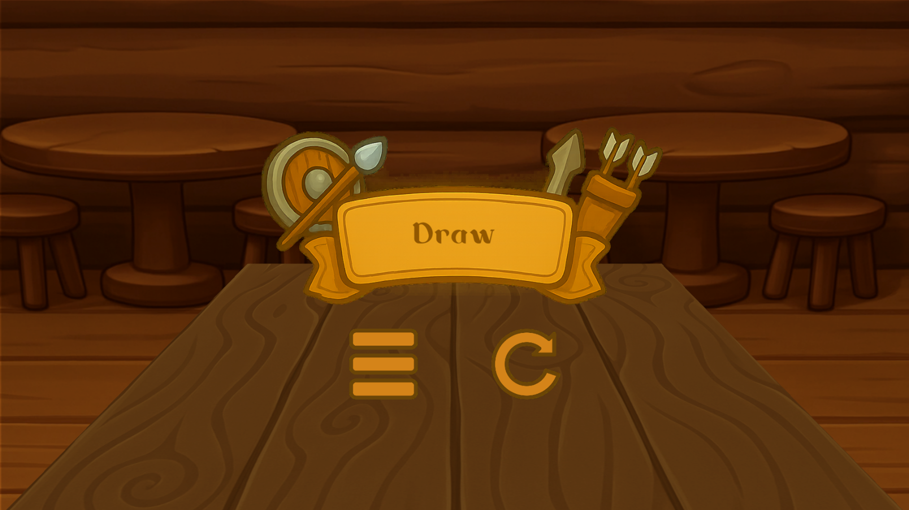

# **Card Game — Unity Demo**


A small card-based game prototype implemented in Unity.
The project demonstrates a turn-based flow, card placement, simple combat logic, animation via a custom tween package, and a lightweight UI.

[](./LICENSE)

---

## Overview

The game is based on a **Rock–Paper–Scissors style interaction**:

| Unit          | Defeats   |
| ------------- | --------- |
| **Mage**      | Swordsman |
| **Swordsman** | Archer    |
| **Archer**    | Mage      |

Each round:

1. The player selects a card from their hand.
2. The opponent selects a random card with a short preview animation.
3. Both cards are revealed simultaneously.
4. The winner is determined using a predefined matrix.
5. After three rounds, the final result is displayed.


## WebGL Version

Playable WebGL build:
**[https://spikethehedgehogdev.github.io/card-game-webgl/](https://spikethehedgehogdev.github.io/card-game-webgl/)**


## Screenshots

### Menu



### Battle



### Result Screen



---

## Technologies

* Unity **6000.0.58f2 (Unity 6)**
* C#
* VContainer (dependency injection)
* UniTask (async/await workflow)
* R3 (reactive event stream)
* Addressables
* ScriptableObjects configuration
* Between (custom tween engine, added via Git URL)

## Main Systems

### **Gameplay Flow**

Implemented through an async sequence:

* card dealing
* player selection
* opponent selection
* reveal
* round evaluation
* discard
* final result

### **Hand System**

* Calculates card positions using a Bezier curve
* Handles hover/selection
* Uses tween animations for movement and transitions

### **Card**

* Spawn/despawn
* Transform animations
* Async movement toward defined board sockets

### **Judge**

A simple matrix-based evaluation:

```
Mage > Swordsman
Swordsman > Archer
Archer > Mage
```

### **Board**

Defines:

* hand root positions
* opened/closed card placement
* discard pile

### **UI**

* Score display
* Result screen
* Menu and restart actions


## Related Repositories

* Tween package (Between):
  [https://github.com/spikethehedgehogdev/BetweenRedKit](https://github.com/spikethehedgehogdev/BetweenRedKit)

* WebGL build:
  [https://github.com/spikethehedgehogdev/card-game-webgl](https://github.com/spikethehedgehogdev/card-game-webgl)

* Addressables bundles (CDN):
  [https://github.com/spikethehedgehogdev/card-game-bundles](https://github.com/spikethehedgehogdev/card-game-bundles)

---

Ilias Abdullin — ([@spikethehedgehogdev](https://github.com/spikethehedgehogdev))